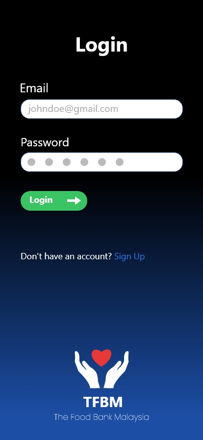
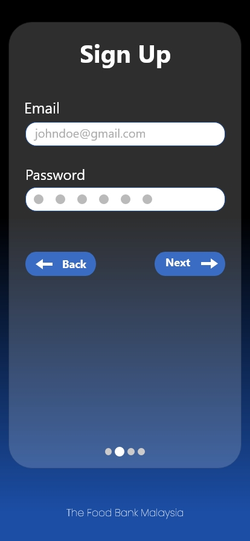
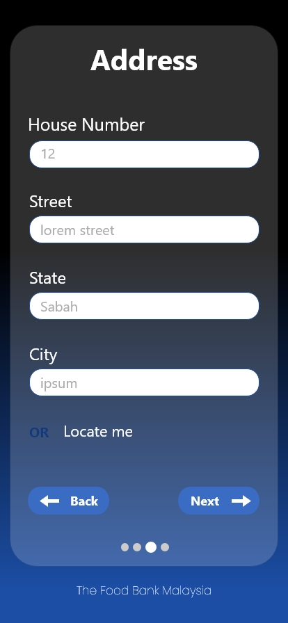
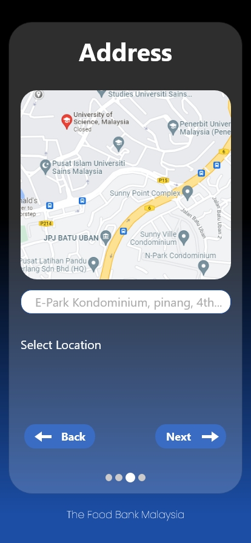
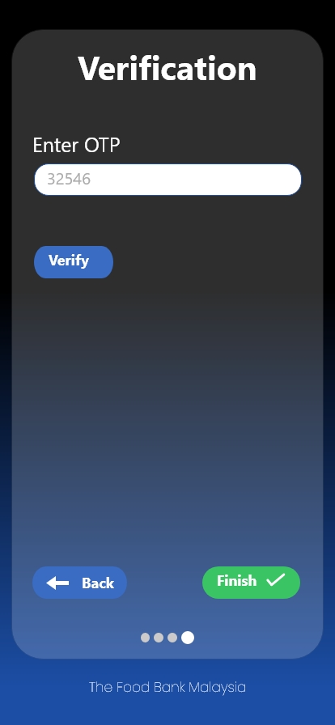
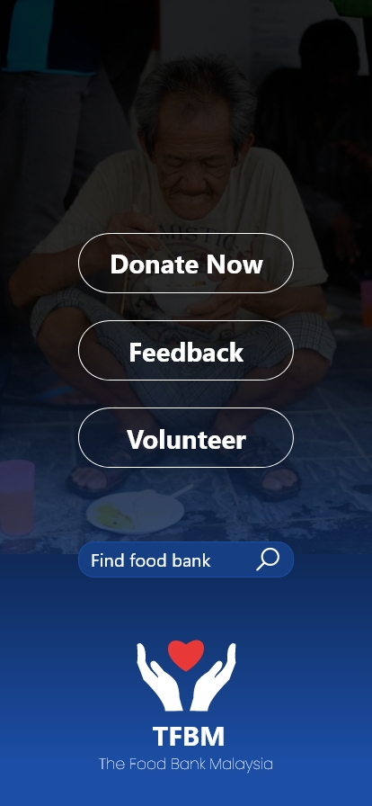
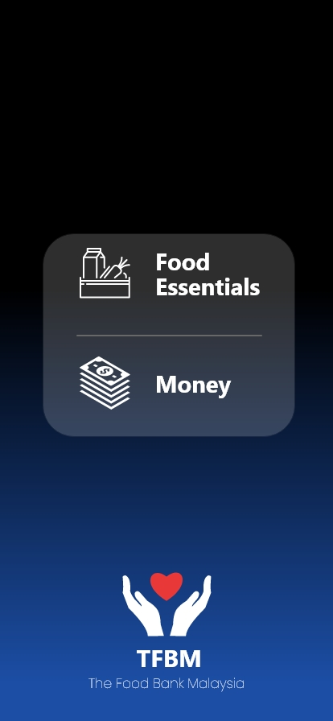

# The Food Bank Malaysia (TFBM)

The mobile & web UI was designed as part of a food bank app project that would help the hungry and needy.

It also reduces food wastage and promotes social work, as people are encouraged to volunteer.

-----------------------------------------------------------------------------------------------

-----------------------------------------------------------------------------------------------

  

  

  

  

  

  

  

  

  

  

  

  

  

  

  

To view more, check [this folder](/web_ui)

